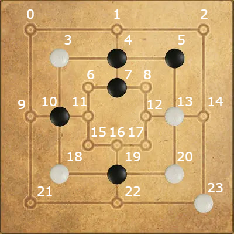

# Nine Men's Morris Game in C++
This is a Nine Men's Morris game implementation written in C++ as part of a C++ lab Course at TUM.
The implementation has a simple command line graphical interface.

## Launching the game
In order to launch the game run the main.cpp file in an appropriate C++ IDE.

## How to play the game
The Board initially contains 24 places where a player can place their pieces.
### Choosing which player starts
Choose 'W' if white player starts or 'B' if black player starts.
### Placing a piece
When asked to place a piece on the board, please choose a number between 0 and 23.
The places on the board are enumerated in the follwoing way:

